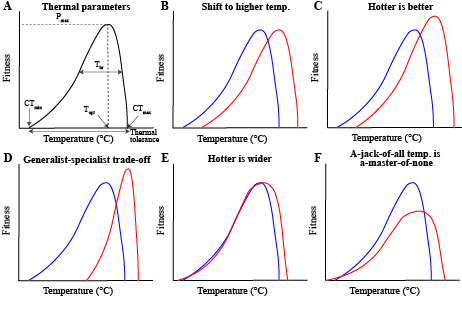
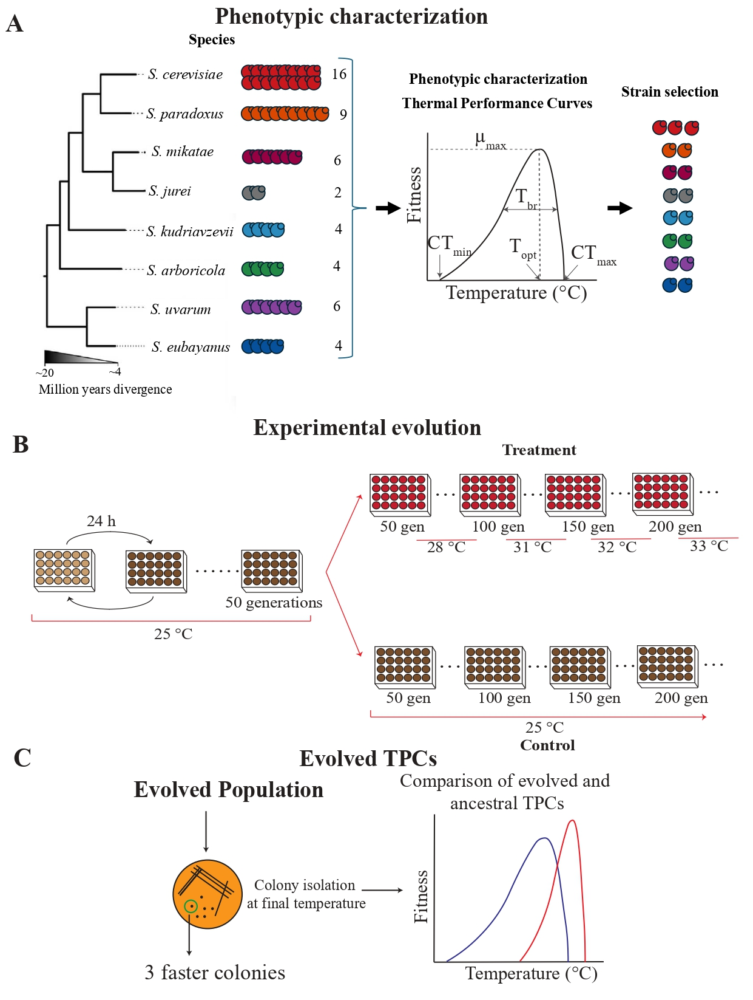

# Thermal Performance Curves (TPCs) evolution in the *Saccharomyces* genus

This repository contains the scripts used in the analysis and generation of results for the paper “*The evolution of thermal performance curves in response to rising temperature across the model genus yeast*”, published in "under revision".

## Description
This study adds a powerful experimental evolution angle to climate change research by tracking thermal adaptation to relevant global warming scenarios in real time, across hundreds of generations. Evolutionary shifts in thermal performance curves (TPCs) in response to rising temperatures across eight genetically diverse *Saccharomyces* yeast species revealed that adaptive responses to climate change are highly species-specific. Heat-tolerant and cold-tolerant species showed distinct adaptive strategies, consistent with either "hotter is wider" or generalist "jack of all temperatures is a master of none" patterns. Our findings reveal the complex interplay between genetic diversity and thermal tolerance evolution, and stress the importance to account for both inter- and intra-species genetic variation when forecasting climate impacts on biodiversity.

## TPCs and simplified alternative hypotheses for their evolution under increasing temperatures.
Figure 1

The ancestral population is blue; the population evolved under increasing temperature is red. 
(A) TPC and its parameters: critical thermal minimum (CTmin), critical thermal maximum (CTmax), maximal performance (Pmax), thermal optimum (Topt), thermal breadth (Tbr, the temperature range across which performance is above 80% of optimal), and thermal tolerance (CTmax minus CTmin). 
(B) Evolved TPC is shifted to higher temperatures with higher CTmin, higher CTmax, and higher Topt. 
(C) Evolved TPC has higher CTmin, CTmax, and Topt, but also higher Pmax (“hotter is better” hypothesis). 
(D)  Evolved TPC with higher Pmax, but narrower Tbr (generalist-specialist trade-off). 
(E) Evolved TPC with wider Tbr than former TPC (“hotter is wider”). 
(F) Evolved TPC with reduced Pmax and increased CTmax than former TPC (“jack-of-all-temperatures is a-master-of-none” hypothesis).

The analyses were performed using R version 4.3.1.

## Experimental design
Figure S1

(A) Phenotypic characterization of *Saccharomyces* strains at different temperatures. 
(B) Experimental evolution approach. 
(C) Evaluation of thermal performance curve evolution

## Content
- `Section1_1.R`: Scripts used for plotting and analyzing natural genetic diversity in temperautre tolerance across eight species of the *Saccharomyces* genus.
- `Section1_2.R`: Scripts used to obtain thermal performance curves and thermal parameters.
- `Section2.R`: Scripts used to evaluate relative fitness between evolved and ancestral strains.
- `Section3.R`: Scripts used to obtain thermal performance curves and thermal parameters of evolved genotypes.
- `data/`: Folder containing the data files used for testing.
- `results/`: Folder with the results generated.
